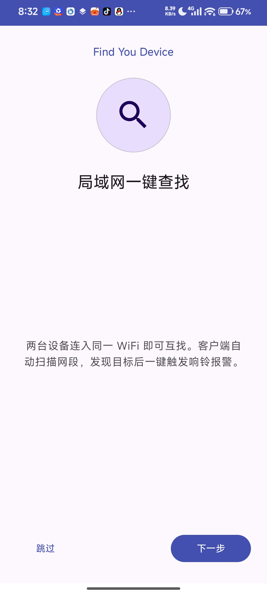
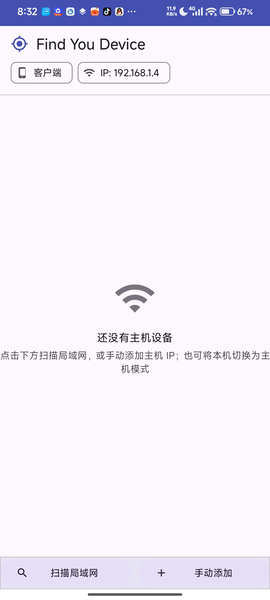
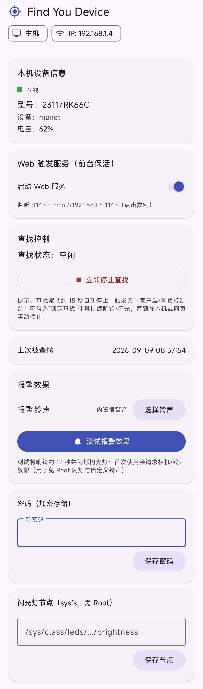
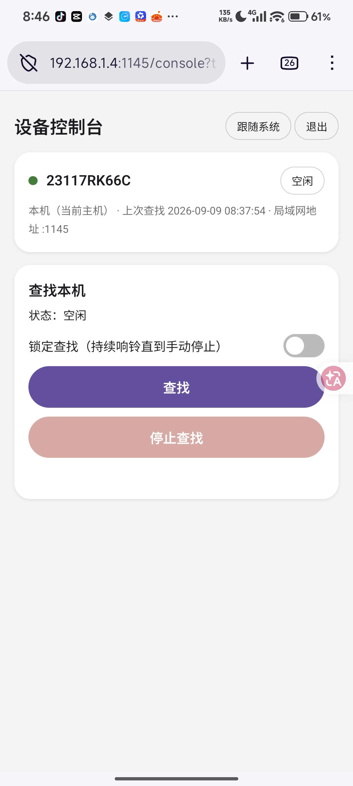

# Find You Device · 局域网设备查找

> 同一局域网（Wi-Fi / 热点 / 有线）内**双向查找**的 Android 应用：一台设备作为**主机**待命，另一台设备（或任意浏览器）一键触发，让主机响铃 + 振动 + 闪光灯爆闪，快速定位"找不到的手机 / 平板 / 电视盒子"。






---

## ✨ 功能特性

### 三端角色
| 角色 | 说明 |
| --- | --- |
| **主机模式**（被查找方） | 开启 Web 服务后后台常驻（前台服务），息屏也能响应局域网内的查找请求；收到请求即播放内置报警音并闪烁闪光灯;无Root或Adb也能够用 |
| **客户端模式**（触发方） | 自动扫描局域网网段，发现主机设备；点"查找"远程触发报警，无需 Root |
| **Web模式**（触发方） | 点"查找"远程触发报警，只需在浏览器输入 主机IP:1145 |

### 核心能力
- **专为类原生而生**：补全了类原生缺失的查找设备，如果有需要像手机厂商一样用云服务查找的需求，可随便修改使其支持公网 IP；
- **四级报警音兜底**：① 用户自选音频 → ② 应用内置 `alarm_alert.m4a`（默认）→ ③ 系统默认闹钟 → ④ ToneGenerator；任何 ROM / 权限组合都能响；
- **强制扬声器**：哪怕插入了 3.5mm 耳机孔，也会强制从扬声器出声，并且调节音量是无用的；
- **闹钟流音量自动保障**：播放前若闹钟流音量过低会自动临时抬高，结束后还原，杜绝"无声报警"；
- **报警组合**：响铃（MediaPlayer）+ 振动（Vibrator 循环）+ 闪光灯爆闪（Camera2 免 Root，失败自动降级 Root sysfs）；
- **锁定查找由触发方决定**：触发那一刻勾选"锁定"= 持续响铃直到手动/远程停止；不勾选 = 15 秒自动停止（客户端面板按 IP 记忆你的选择）；
- **远程停止**：客户端设备面板 / 网页控制台均可随时中断报警，停止操作幂等；
- **网页控制台**：任意浏览器访问 `http://主机IP:1145`，输密码解锁（会话 Token 6 小时）后进入控制台，可触发查找 / 锁定 / 停止 / 实时状态轮询；
- **自定义报警铃声**：Android 系统文件选择器（SAF）挑选任意音频文件（mp3 / m4a / wav / ogg / flac 等），授权持久化、免媒体库权限；
- **OOBE 首启引导**：首次安装展示 3 页功能引导，老用户升级自动跳过；
- **Material 3 设计**：动态取色主题 + 明暗切换（网页端三态主题同源）。

---

## 📦 运行环境

| 项 | 要求 |
| --- | --- |
| Android | 8.0（API 26）及以上；在Android 12/ exTHmUI || Android 14 / HyperOS Ⅱ Firefox Night/Edge实测 |
| 网络 | 与主机接入同一局域网 |
| Root | **非必需**：客户端免 Root；主机响铃/振动/闪光均免 Root，Root 仅用于增强（亮屏保持、sysfs 闪光兜底、部分状态读取） |
| 存储 | 选择自定义铃声时才需要文件访问（SAF 授权） |

---

## 🚀 快速开始

### 构建 APK
```bash
# 工程根目录（需 JDK 17）
gradle-8.2 :app:assembleDebug            # 或 ./gradlew :app:assembleDebug
# 产物：app/build/outputs/apk/debug/app-debug.apk
```
构建参数：AGP 8.2.2 · Kotlin · compileSdk 34 · minSdk 26 · Java 17。

### 安装
```bash
adb install -r -t app/build/outputs/apk/debug/app-debug.apk
# 或直接拷贝 APK 到手机安装
```

### 首次使用
1. 打开 App → OOBE 引导页（可跳过）→ 选择**模式**；
2. **被查找设备**：选"主机模式"→ 设置访问密码（可选）→ 打开"Web 服务"开关，记下顶部 IP；
3. **查找设备**：选"客户端模式"→ 应用自动扫描 → 点设备卡片的"查找"按钮 → 目标立即响铃爆闪。

### 网页触发（无需装客户端）
浏览器打开 `<主机IP>:1145` → 输入密码解锁 → 控制台内触发/停止/锁定查找。

---

## 🔐 权限说明

| 权限 | 用途 | 可否拒绝 |
| --- | --- | --- |
| 相机 Camera | 闪光灯爆闪（Camera2 setTorchMode） | 可，自动降级 Root sysfs 或跳过闪光 |
| 前台服务 | Web 服务后台常驻 | 主机模式必需 |
| 网络状态 | 读取网段用于扫描/展示 IP | 客户端必需 |
| 振动 / 唤醒锁 | 报警振动与保持唤醒 | 可 |
| 多媒体音频读取（13+） | 兼容旧版自定义铃声 | 已不再请求（SAF 取代） |
| **定位权限** | —— | **从不申请** |

---

## 🧱 技术架构

轻量 HTTP 服务器（原生 `ServerSocket` + 线程池，无第三方 Web 依赖），代码结构：

```
app/src/main/java/com/mimo/findyoudevice/
├── MainActivity.kt          主容器：OOBE/模式分流、双模 Fragment 切换、共享 ViewModel
├── OnboardingActivity.kt    OOBE 首启引导（ViewPager2 + 指示点）
├── ModeSelectionActivity.kt 模式选择（主机 / 客户端）
├── HostFragment.kt          主机页：Web 开关/自检、密码、铃声选择(SAF)、测试报警、查找状态
├── HostService.kt           前台服务，承载 WebServer（specialUse）
├── WebServer.kt             自研 HTTP 服务：/info /verify /console /status /find /stop；
│                            内含 internal RootShell（su 探测与一次性指令通道）
├── ClientFragment.kt        客户端页：设备列表、网段扫描、操作面板（查找/锁定/停止）、密码记忆
├── DeviceAdapter.kt         客户端设备列表 RecyclerView 适配器
├── LanScanner.kt            多网段扫描、triggerFind / stopFind 远程调用
├── AlarmController.kt       查找动作统一控制器：epoch 防竞态、锁定/定时语义
├── AlarmRinger.kt           响铃+振动：四级音源兜底、闹钟流音量保障
├── TorchBlinker.kt          闪光灯爆闪：Camera2 优先、sysfs Root 兜底
├── Prefs.kt                 SharedPreferences：模式/密码哈希/铃声/按IP记忆锁定与密码/OOBE
├── MainApplication.kt       应用入口：Room 全局单例（懒加载 + Double-Check）
└── data/                    Room 层：DeviceDatabase / DeviceDao / DeviceEntity（客户端已添加设备）
```

### 网页 HTTP 接口（端口 `1145`）

| 接口 | 方法 | 鉴权 | 说明 |
| --- | --- | --- | --- |
| `/info` | GET | 免 | 主机型号 + 电量（扫描/首页信息卡用） |
| `/verify` | POST | 密码 | 校验密码，签发 6 小时会话 Token |
| `/console?t=` | GET | 会话 Token | 单机控制台页面（查找/锁定/停止/轮询） |
| `/find` | POST | Token / Basic / 密码 | 触发查找；`lock=1` 锁定无限，`dur=` 覆盖秒数 |
| `/stop` | POST | Token / Basic / 密码 | 立即停止查找（幂等） |
| `/status?t=` | GET | 会话 Token | 运行状态 / 剩余时长 / 电量 / 上次被查找时间 |

> 鉴权来源四选一：`Authorization: Basic admin:明文密码`、`X-Auth-Token`（存储哈希或会话 Token）、表单/JSON `pass`、会话 Token（Header / query `t` / form `t`）。

### 安全语义
- 密码以 **SHA-256 哈希**存储，不落明文；
- 会话 Token 36 位随机 hex，6 小时滚动续期，服务端定时清理过期项；
- Web 解锁页与控制台按密码/Token 双重隔离，未鉴权一律 401。

---

## ❓ 常见问题

**Q：网页提示 HTTP 401 / 无法连接？**
401 表示 Token 过期或密码错误，回首页重新解锁即可；请确认浏览器与主机同一网络、地址为 `http://IP:1145`以实际 IP 为准，比如192.168.1.5。

---

## 📝 更新记录

| 版本 | 内容 |
| --- | --- |
| v1.0 | 主机/客户端双模、免定位扫描、自研 Web 服务、响铃/振动/闪光报警、密码鉴权、会话 Token、网页控制台、按 IP 记忆锁定与密码、SAF 自定义铃声、内置 m4a 报警音 + 闹钟流音量保障、OOBE 引导、Material 3 全量改造 |
| v1.1 | 引入 [Miuix](https://github.com/compose-miuix-ui/miuix) 类小米风格组件库（Apache-2.0）；OOBE 重制为 Compose 并支持界面风格选择（默认 MD3，含组件预览对比）；新增 MIUI X 风格设置页（大标题 / 分组卡片 / 风格选择弹窗 / 组件预览），可随时切换风格 |

---

## 🤔 开发者

deepseek-v4-flash 100%
Tokens 32,116,491
AI 太好用了你知道吗😱

---

## 📮 联系作者

- QQ：3891605032
- 邮箱：fxxkhw676767@outlook.com

---

## ⚖️ License

- 本项目：[MIT License](LICENSE)
- 第三方组件：[Miuix](https://github.com/compose-miuix-ui/miuix)（[Apache License 2.0](third_party/miuix/LICENSE)，用于 OOBE 与设置页的类小米风格界面）

仅供学习与个人设备管理使用，请勿用于任何侵犯他人隐私的场景。
